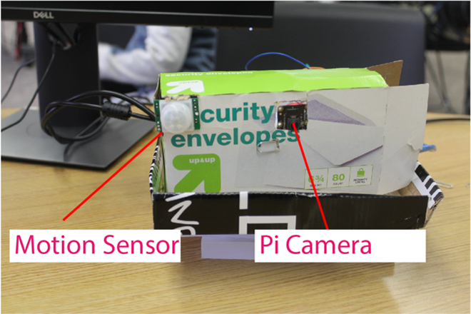
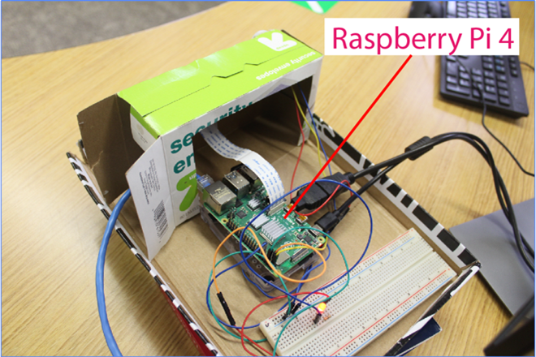
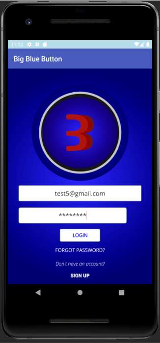
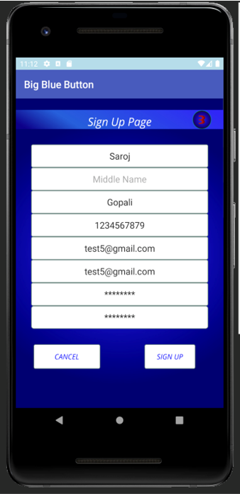
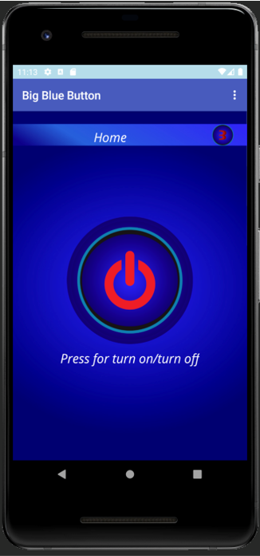
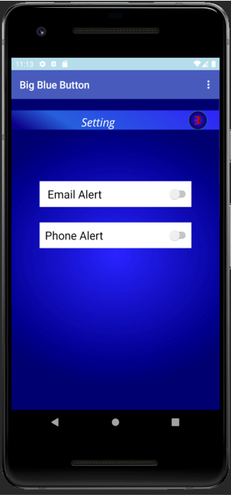
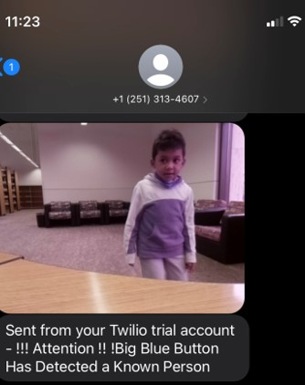
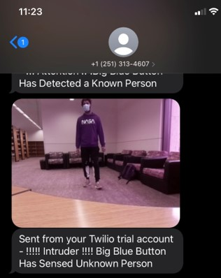

Senior Capstone from Fall 2020

Our team project was to develop a Rasberry Pi Security Camera with Facial Recognition.
The attached PDF has the contains the project documentation, all diagrams, implementation details, and functionalities:
https://github.com/Camgibso/Senior-Capstone/blob/main/Capstone_Final.pdf

Pictures of our hardware device, camera, motion detector and homeade stand:

 

-----------------------------------------------------------------------------------
Preview of the mobile application:

-----------------------------------------------------------------------------------
Preview of the mobile notification:

